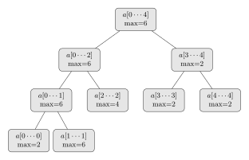
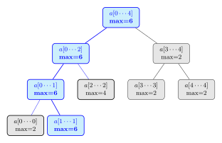
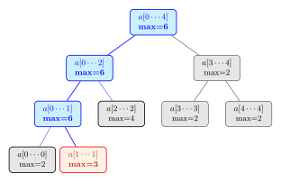
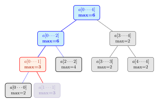
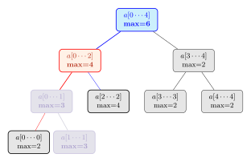
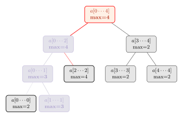

# Day 9: Disk Fragmenter

## Input Bounds

From preliminary data analysis, the input is simply a very long string with numeric characters, inclusive of 0.

## Part A

### Abridged Problem Statement

You are given a disk map, which is a string of numbers. The disk is alternates between memory blocks and free space. Each digit of the disk map switches between indicating the length of a memory block and the length of some free space, starting with the length of a memory block. A length 0 block is also valid.

Each memory block also has an ID, which is 0-indexed and depends on its original position before anything is rearranged.

You move each memory block one at the time, starting from the rightmost memory block, moving it to the leftmost block of free space, until there are no more gaps between file blocks.

Lastly, you need to compute the *checksum* after this movement. Let the memory block ID at position $i$ (0-indexed) be $f_i$ after rearrangement. Then, the checksum $C$ is given by

$$C = \sum_{i=0}^n i \cdot f_i$$

### Solution

Use a two-pointer approach, and maintain the current starting index if the string were to be expanded. When you encounter:

* An occupied memory chunk

Calculate the checksum of this memory chunk by determining the current starting index and its ending index. Then, simply calculate the sum of the consecutive integers between these two indices, and multiply it by the file ID.

That is, if the starting index is $x$, and the length of the memory chunk is $l$, and the file ID is $d$, then the checksum of this segment is given by 

$$C = \frac{(x+l)(l-x + 1)}{2} \cdot d$$

* A chunk of free space

We will then move our right pointer leftwards until we meet a chunk of occupied memory. There are two cases:

1. This chunk of occupied memory can fit completely in our chunk of free space.

In which case, we move it to the chunk of free space and calculate the checksum as per above. We then continue moving leftwards until we meet another chunk of occupied memory, or until we meet the left pointer.

2. This chunk of occupied memory cannot completely fit in our chunk of free space.

Then, we move as much memory as possible to the free space and calculate the checksum. We then reduce the amount of occupied memory we need to move by the amount of free space available, and move on to moving the left pointer again.

Lastly, we make a note on how to efficiently get the memory chunk ID from its position in the original string. We note that the ID of a memory chunk in position $i$ will be $\frac{i}{2}$, since the memory chunks are all in even positions (0-indexed).

### Code Complexity

**Time Complexity:** $O(N)$

* $N$ is the number of characters in the string.

We use a two-pointer approach, so each character in the string will be processed at most once.

**Additional Space Complexity:** $O(N)$

We need to store the whole string in a vector.

**Final answer:** 6463499258318.

## Part B

### Abridged Problem Statement

You are given a disk map, which is a string of numbers. The disk is alternates between memory blocks and free space. Each digit of the disk map switches between indicating the length of a memory block and the length of some free space, starting with the length of a memory block. A length 0 block is also valid.

Each memory block also has an ID, which is 0-indexed and depends on its original position before anything is rearranged.

You move each memory block one at the time, starting from the rightmost memory block, moving it to the leftmost block of free space **that can fit the entire block**. If no such blocks exists, do not move the memory block.

Lastly, you need to compute the *checksum* after this movement. Let the memory block ID at position $i$ (0-indexed) be $f_i$ after rearrangement. Then, the checksum $C$ is given by

$$C = \sum_{i=0}^n i \cdot f_i$$

### Solution

We note that for each memory block, we want to find the leftmost memory block that has a length longer than or equal to the length of the memory block. 

Let the list of lengths of the blocks of free space be $A$. Effectively, for a memory block of length $k$, we are looking for the leftmost number, $x$, such that $x \geq k$. Afterwards, we subtract $k$ from $x$.

In essence, this boils down to a set of query and update on the array $A$.

* **Query($\boldsymbol{k}$):** Find the smallest index, $i$ in $A$ such that $A_i \geq k$.
* **Update($\boldsymbol{i}, \boldsymbol{k}$):** Subtract $k$ from $A_i$.

We can perform both queries in $O(\log N)$ time by constructing a range-maximum segment tree.

For example, for the input $92765432423$, we can filter the memory blocks into $M = \{9,7,5,3,4,3\}$ and the spaces into $A = \{2,6,4,2,2\}$. We can then construct the segment tree on $A$ as follows:

#### Query

To perform the query, we perform a technique known as **fractional cascading**.

Since we want to find the leftmost index, $i$, such that $A_i \geq k$, we will simply descend down the leftmost path that satisfies the inequlity above. 

Therefore, in order of priority,

* We simply check if the left node, $S_l \geq k$. If so, we descend down that path. 
* Otherwise, we descend down the right path if $S_r \geq k$. 
* If both paths are less than $k$, then we know that the entire array $A$ is less than $k$, and that no such numbers exist in the array.

In our example given above, taking the rightmost memory block, we need a free space with a length of at least 3. 

We first check if the root satisfies the inequality. That is, we need to check for the existence of such a number that satisfies the inequality in the first place. Our root, 6, is greater than $k=3$. Thus, such a number exists in our array. We then track the leftmost path that satisfies, the inequality, and we will therefore have the path:

Therefore, we have found the index of the leftmost number in $A$, such that it is greater than or equal to $k=3$.

It can be shown that we only need to visit at most $\log N$ nodes for any query.

#### Update

We now want to update the value in $A_1$ to subtract it by $k=3$. To do so, we need to update $A_1$ and all its parents. That is, all the nodes in blue in the diagram above needs to be updated.

To start off, we will update the node corresponding to $A_1$.

We will then propagate upwards and compare the children of the parents to recalculate the maximum values, if applicable. In order, we have the first parent having a new maximum of 3, since its 2 children are 2 and 3.

Then, its parent has a new maximum of 4, since its children are 3 and 4.

Lastly, the changes are propagated to the root, which has a new maximum of 4, since its children are 4 and 2.

Since we have reached the root, the update operation is now complete.

It can be shown that we will update at most $\log N$ nodes in the segment tree.

#### Completing the Solution

We can then perform the rest of the operations in order, from the rightmost memory block to the leftmost memory block. 

The checksum can be computed similar to part A, but we will need to store a prefix sum to determine the positions of memory blocks and free space respectively.

#### Implementation Details ($2N$ and $4N$ node segment trees)

Lastly, we will make a note on implementation.

To improve efficiency, we avoid storing a pointer to the left and right node in the segment tree. We therefore store the elements in an array, with their indices implicitly describing the structure of the segment tree.

There are two main ways to write a such a segment tree, the memory-efficient approach using $2N$ nodes, and the recursive approach using $4N$ nodes. 

In both approaches, the children of a node $x$ will be $2x$ and $2x + 1$. Conversely, the parent of a node will be $\lfloor \frac{x}{2} \rfloor$. However, they differ in where the nodes are stored.

* In the memory-efficient $2N$ node approach, the nodes are stored in order, that is, the root is stored at index $1$, and its children are stored at index $2$ and $3$. The children of index $2$ will be stored at indices $4$ and $5$, and that of index $3$ will be stored at indices $6$ and $7$.   
However, do note that not all nodes will necessarily have 2 children if the array size is not a power of 2, but the numbering will follow the order of the indices.  
The array will therefore be stored at indices $s$ to $2s-1$, where $s$ is the size of the array. 

The $2N$ nodes memory-efficient segment tree cannot be used here, since it is not degenerate. For example,

<figure>
    
    <figcaption id="segTreeCaption"><i>Source: <a href="https://codeforces.com/blog/entry/18051">Efficient and Easy Segment Trees, Codeforces</a></i></figcaption>
</figure>
 

We note that the right segment of the root actually contains the leftmost element in the array at index 13. Due to this, we cannot guarantee that the leftmost child in the segment tree corresponds to a left element in the array.

In the $4N$ node approach, each level of the segment tree is padded to the a size that is a power of 2. 

Therefore, the array will always be stored in the indices
$2^{\lceil\log_2s\rceil}$ to $2^{\lceil\log_2s\rceil} + s$, if the array is 1-indexed, where $s$ is the size of the array. 

In such a case, the left child in the segment tree will always correspond to the an element that is left in the array.

Hence, we must use this $4N$ node implementation, which is commonly implemented using recursion, but can also be implemented using iteration (as with my solution).

### Code Complexity

**Time Complexity:** $O(N \log N)$

* $N$ is the number of characters in the string.

Each query and update takes $\log \frac{N}{2}$ time, since there are $\frac{N}{2}$ blocks of free space. We need to perform a query and update for every memory block in the string, of which there are $\frac{N}{2}$ such memory blocks.

**Additional Space Complexity:** $O(N)$

We need $4N$ nodes in the array to store the segment tree.

**Final answer:** 6493634986625.

All code can be found at [my github repository](https://github.com/dillionlim/advent-of-code-2024/tree/main).